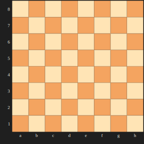
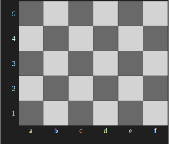

# Graphviz::DOT::Chessboard

Raku package for making chessboard plots via the 
[DOT language](https://graphviz.org/doc/info/lang.html) 
of 
[Graphviz](https://graphviz.org).

----- 

## Installation

From Zef ecosystem:

```
zef install Graphviz::DOT::Chessboard
```

From GitHub:

```
zef install https://github.com/antononcube/Raku-Graphviz-DOT-Chessboard.git
```

-------

## Basic usage

Load the package:

```raku
use Graphviz::DOT::Chessboard;
```

Generate DOT spec:

```raku
say dot-chessboard(4, 4, title => 'Example small chessboard'):!svg;
```

Generate an SVG plot:

```raku
my %opts = black-square-color => 'SandyBrown', white-square-color => 'Moccasin', :4size;
dot-chessboard(8, 8, |%opts):svg;
```



Using a FEN string (on a smaller board):

```raku
my $fen = '8/8/8/3K4/5r2/8/1k6/8';

dot-chessboard($fen, :5r, :6c):svg
```



------

## TODO

- [X] DONE White pieces should have contours
- [X] DONE Chess positions by Forsyth-Edwards Notation (FEN) strings 
- [ ] TODO Fuller set of unit tests
- [ ] TODO CLI script

------

## References

[AAp1] Anton Antonov,
[Graph Raku package](https://github.com/antononcube/Raku-Graph),
(2024),
[GitHub/antononcube](https://github.com/antononcube).

[AAp2] Anton Antonov,
[Graphviz::DOT::Grammar Raku package](https://github.com/antononcube/Raku-Graphviz-DOT-Grammar),
(2024),
[GitHub/antononcube](https://github.com/antononcube).